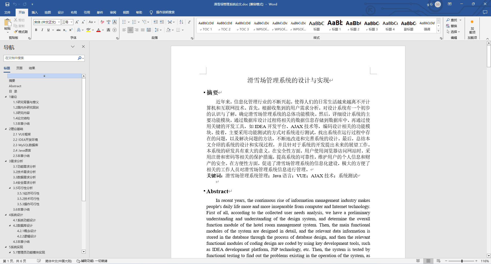
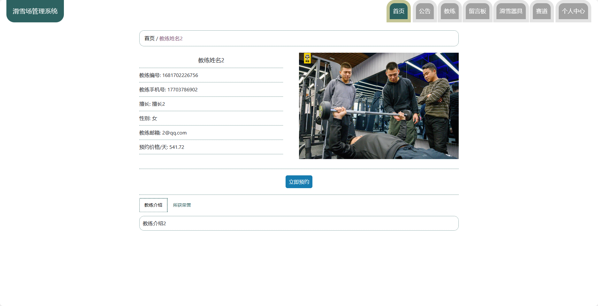
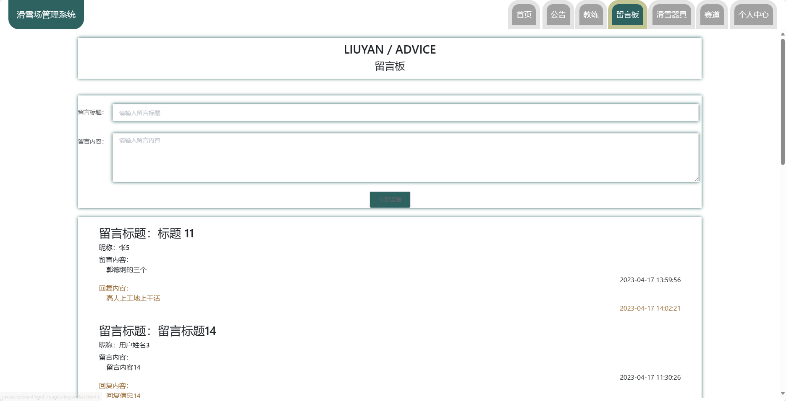
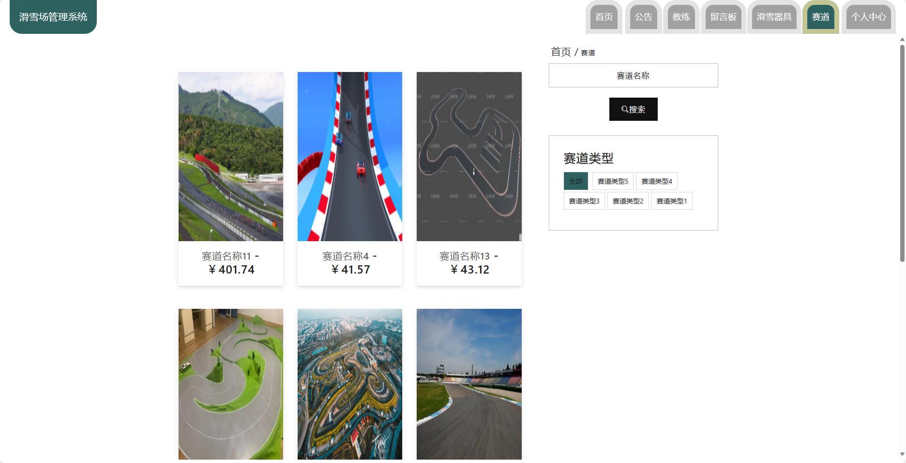
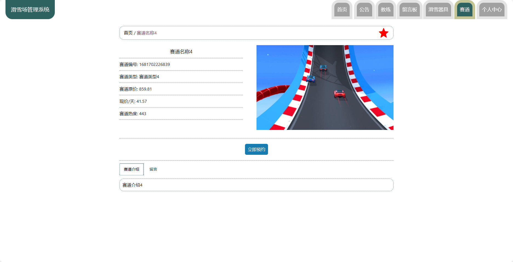
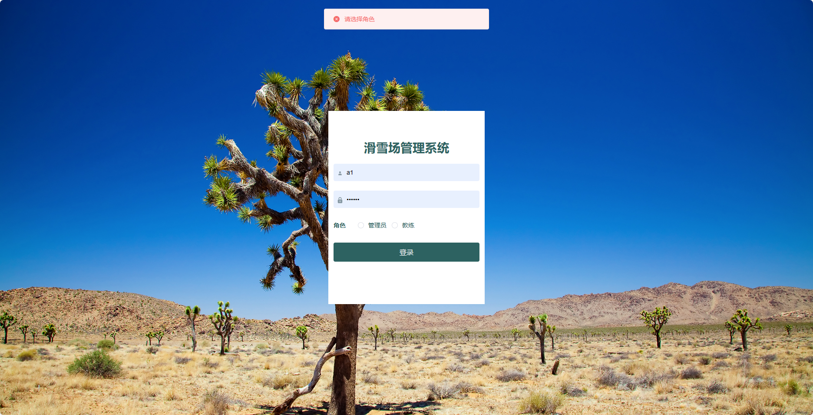
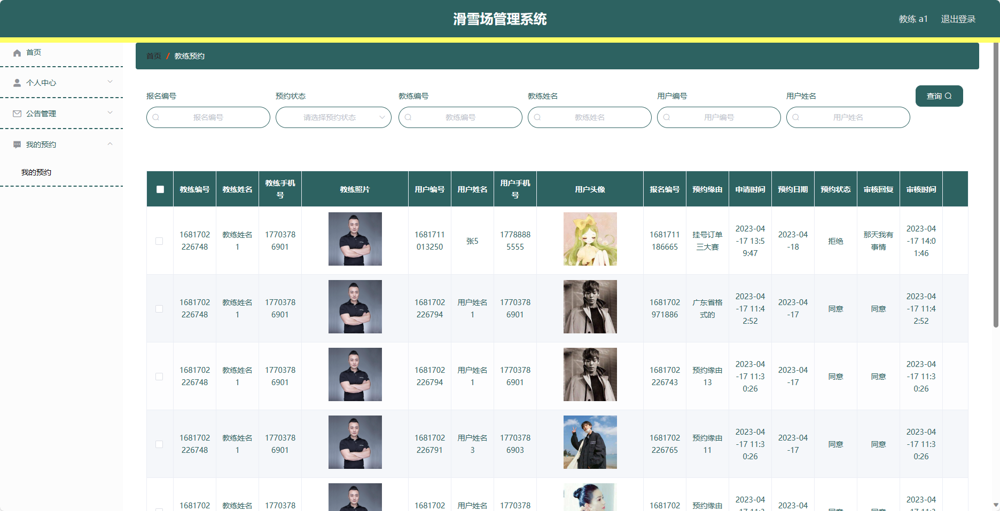

## 基于SpringBoot的滑雪场管理系统(程序+报告)

###  获取sql数据库文件: 从戎源码网 (https://armycodes.com/) QQ: 386869957 QQ群: 377586148
###  所有系统地址: (https://github.com/YuLin-Coder/AllProjectCatalog) 
###  所有项目以及源代码本人均调试运行无问题 可支持远程安装部署调试、定制修改、代码讲解

## 项目介绍
基于SpringBoot的滑雪场管理系统，系统包含两种角色：管理员、用户,系统分为前台和后台两大模块，主要功能如下。

### 【管理员】:
- 个人中心：管理个人信息。
- 管理员管理：管理其他管理员账户。
- 基础数据管理：管理系统的基础数据。
- 公告管理：发布和管理公告信息。
- 留言板管理：管理留言板的内容。
- 教练管理：管理滑雪场的教练信息。
- 滑雪器具管理：管理滑雪场的器具信息。
- 赛道管理：管理滑雪场的赛道信息。
- 用户管理：管理系统的用户信息。
- 轮播图信息：管理首页轮播图的展示信息。

### 【教练】:
- 个人中心：管理个人信息。
- 公告管理：发布和管理公告信息。
- 我的预约：查看和管理教练的预约情况。

### 【前台】:
- 首页：展示系统的概览信息。
- 公告：查看滑雪场发布的公告。
- 教练：了解滑雪场的教练信息。
- 留言板：与其他用户进行交流和留言。
- 滑雪器具：浏览可租借的滑雪器具信息。
- 赛道：了解滑雪场提供的赛道信息。
- 个人中心：管理个人信息。

## 项目技术
- 编程语言：Java
- 数据库：MySQL
- 项目管理工具：Maven
- 前端技术：HTML、CSS、JavaScript、Jquery、Vue
- 后端技术：Spring、SpringMVC、MyBatis

## 运行环境
- JDK版本：JDK1.8及以上
- 开发工具：IDEA、Ecplise、Myecplise都可以
- 数据库: MySQL5.7及以上
- Maven：maven3.0及以上
- Node：14.14.0及以上

## 运行截图

